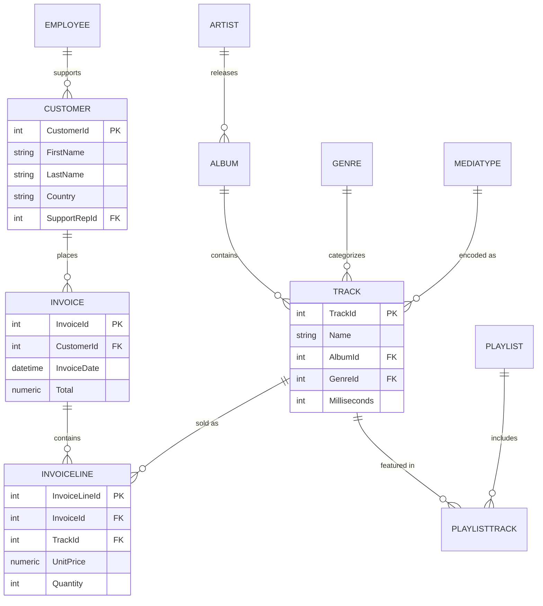

# Digital Music Store — SQL Business Analysis

A SQL portfolio project analyzing a digital music store's sales, customers, and catalog to answer real business questions — built on the Chinook dataset (a standard, public-domain digital-media-store schema) using SQLite.

## Objective

Simulate the kind of ad-hoc analysis a Data/BI Analyst would be asked to run for a music retailer: who are the best customers, which markets and genres drive revenue, how is the sales team performing, and where is the catalog underperforming.

## Tech Stack

- **SQLite** — zero-setup relational database, portable as a single file
- **SQL** — joins, subqueries, CTEs, window functions (`RANK`, running totals)
- **Python (sqlite3)** — used only to run and verify queries for this write-up; all analysis logic lives in `queries.sql`

## Dataset

[Chinook Database](https://github.com/lerocha/chinook-database) — a digital media store dataset modeled after an iTunes-style catalog.

| Table | Rows | Description |
|---|---|---|
| Customer | 59 | Customer profile & billing info |
| Invoice | 412 | Orders placed |
| InvoiceLine | 2,240 | Line items per order (track + qty + price) |
| Track | 3,503 | Song catalog |
| Album | 347 | Albums |
| Artist | 275 | Artists |
| Genre | 25 | Music genres |
| Employee | 8 | Sales/support staff |
| Playlist / PlaylistTrack | 18 / 8,715 | Curated playlists |

## Schema (ER Diagram)



## Business Questions Answered

Full commented queries are in [`queries.sql`](queries.sql). Twelve questions total, covering customer value, revenue geography, genre/artist performance, employee performance, time trends, churn risk, and catalog utilization.

## Key Findings

1. **Revenue is USA-heavy but not USA-dependent.** The USA accounts for ~22% of total revenue ($523 of ~$2,328), with Canada second at ~13%. No single country exceeds a quarter of total revenue, meaning the business isn't overexposed to one market.

2. **Rock dominates catalog sales.** Rock alone accounts for 835 of the top-5-genre track sales (~$827 in revenue) — more than double the next genre (Latin, 386 tracks). Inventory and marketing decisions should weight heavily toward rock-adjacent content.

3. **43% of the catalog has never sold a single copy.** Of 3,503 tracks, only 1,984 have ever appeared in a completed sale — meaning 1,519 tracks (43.4%) are dead inventory. This is the single most actionable finding: a large share of the catalog isn't earning its shelf space, and could be a candidate for delisting, bundling, or promotional pricing.

4. **Sales performance across reps is fairly even.** The top rep (Jane Peacock, $833 across 21 customers) leads but isn't dramatically ahead of the second and third reps ($775 and $720) — suggesting consistent process/training across the team rather than one standout performer.

5. **Order values are small and consistent.** Average order value sits in the $5–7 range across most countries, with no country showing dramatically higher per-order spend — this is a high-frequency, low-ticket business, so retention/repeat-purchase strategy likely matters more than upselling within a single order.

## How to Run This

```bash
# 1. Clone the repo
git clone https://github.com/<your-username>/music-store-sql-analysis.git
cd music-store-sql-analysis

# 2. chinook.db is included directly in the repo — no separate download needed.

# 3. Run any query, e.g. using the sqlite3 CLI:
sqlite3 chinook.db < queries.sql

# or open chinook.db in DB Browser for SQLite (free, GUI) and run
# queries.sql section by section, or connect via Python:
python3 -c "import sqlite3; con = sqlite3.connect('chinook.db'); print(con.execute('SELECT * FROM Customer LIMIT 5').fetchall())"
```

## What I'd Explore Next

- Cohort analysis: do customers acquired in different years show different lifetime value?
- Cross-sell patterns: which genres/artists are frequently purchased in the same invoice?
- A lightweight Python/pandas layer to turn `queries.sql` output into charts for a one-page visual summary.

---
*Built as part of a personal SQL portfolio project. Dataset: [Chinook](https://github.com/lerocha/chinook-database) (public domain, standard practice dataset).*
